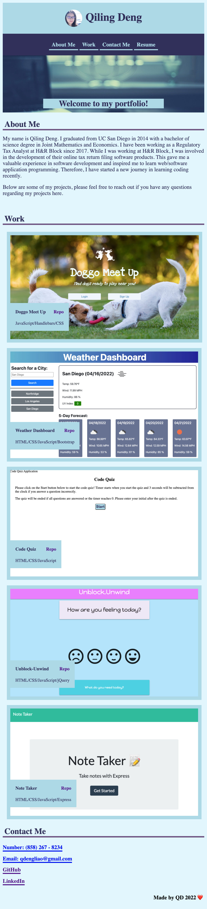
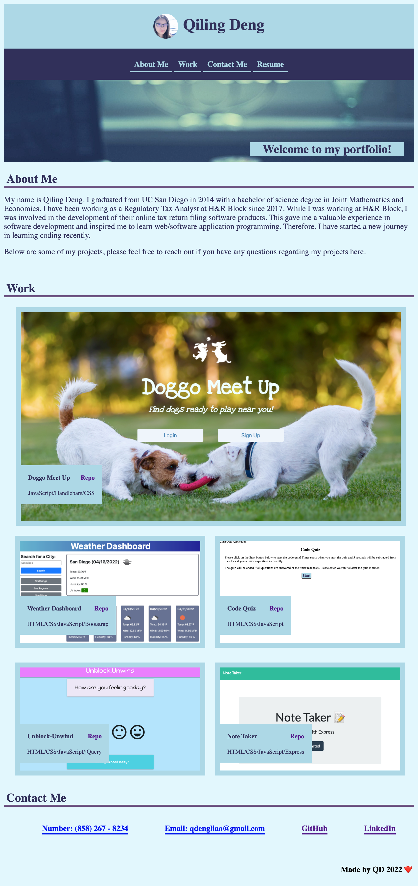

# My Personal Portfolio


## Link

### Please click [here](https://qd9069.github.io/my_updated_portfolio/) to find the deployed project.

## Table of Contents 

- [Link](#link)
- [Description](#description)
- [Usage](#usage)
- [Technology](#technology)
- [Assets](#assets)
- [License](#license)


## Description

Welcome to my personal portfolio page!

In this webpage, you will see projects and work applications that I have been developed and deployed. My contact information and link for the resume have been included in this portfolio page.

Please feel free to reach out if you have any questions or comments regarding my portfolio webpage or other projects!


## Usage

- **Navigation Bar**: Click on one of the links in the navigation, the UI will scroll to the corresponding section.
    - The Resume link will redirect user to view a downloadable PDF of my resume
- **Work**: Click on the images of the work applications, user will be taken to that deployed application.
    - Click on the Repo link next to the application title, user will be redirected to the GitHub Repo page for that project.
- **Contact Me**:
    - Click on the GitHub link to visit my GitHub profile page.
    - Click on the LinkedIn link to visit my LinkedIn profile page.

## Technology

```md
- HTML
- CSS
```

## Assets

The following images demonstrate the web application's appearance and functionality:

**Mobile**:



**Tablet**:



**Desktop**:


## License

Copyright (c) 2022 Elaine D. Released under the MIT [License](./LICENSE).

---
Code originally by QD 2022 🏆 
